*Anomaly Detection*

---

## Abstract

We tackle unsupervised anomalous-sound detection on the AML 2025 “slide-rail” subset. Only normal recordings are available for training, so the problem is cast as one-class novelty detection. Our best system couples an **Audio Spectrogram Transformer (AST)** encoder with a lightweight UNet-styled decoder and reaches **0.943 AUC**, a 22-point absolute gain over the vanilla MLP auto-encoder baseline.

Pre-trained audio encoders (PANNs \[@kong2019], AST \[@gong2021]) provide richer latent spaces than raw log-mel input. Decoder capacity matters: skip connections in a UNet \[@ronneberger2015] recover fine-grained details that reveal subtle anomalies. Moreover, simple design choices (early stopping, LR scheduling) yield a further +2 pt AUC.

---

## Introduction

In this challenge, we address an unsupervised anomaly-detection problem based on audio recordings of slide-rail machines from the DCASE-inspired AML 2025 dataset. As only normal samples are provided during training, the task requires models to detect unseen anomalous behavior based on deviations from learned patterns. A widely adopted strategy for such unsupervised settings is to use an autoencoder (AE) architecture, where an encoder compresses the input and a decoder attempts to reconstruct it. Anomalies are then detected via the reconstruction error (e.g., mean squared error). As a starting point, we employ a basic AE composed of MLP-based encoder and decoder, serving as our benchmark.

To improve performance, we explore enhancements to both the encoder and decoder components. Since the input features—mel-spectrograms—are essentially time-frequency representations with image-like structure, we hypothesize that convolutional encoders (CNNs) such as PANNs (Large-Scale Pretrained Audio Neural Networks for Audio Pattern Recognition) can better extract spatial patterns compared to simple MLPs. This is particularly relevant as PANNs leverage both raw waveforms via 1D CNNs and log-mel spectrograms through 2D CNNs, allowing for richer feature extraction. Moreover, to capture broader contextual relationships, we experiment with Transformer-based encoders like the Audio Spectrogram Transformer (AST), which leverage self-attention to model long-range dependencies in the spectrograms.

On the decoder side, we compare MLP-based decoders with UNet-style decoders that integrate multi-scale skip connections, allowing finer-grained reconstructions that may better expose subtle anomalies. This leads us to evaluate a range of architectures—PANN-MLP, PANN-AE, PANN-UNet-MLP, and AST-based variants—to investigate how combinations of encoder strength and decoder design impact anomaly detection performance.

Our study emphasizes architectural diversity and systematic comparison, aiming to identify model families best suited to mel-spectrogram inputs under the one-class learning paradigm.

---

# Data Analysis and Mel-Spectrograms

## Data Overview

We use audio recordings from the Slide rail machine category in the DCASE-inspired AML 2025 dataset. Each sample is a 10-second mono-channel audio clip recorded at 16 kHz, containing operational machine sounds possibly mixed with background factory noise. Since this is an unsupervised anomaly-detection task, only normal samples are available during training, while anomalous samples are reserved for testing.

## Mel-Spectrogram Representation

To extract meaningful acoustic features, each audio clip is converted into a mel-spectrogram—a time-frequency representation that reflects human auditory perception. This transformation converts the raw waveform into a 2D image-like format, enabling the use of CNNs or Transformers for feature extraction. The configuration used for mel-spectrogram generation is as follows:

* **Sample rate:** 16 000 Hz
* **Window size:** 512 samples
* **Hop length:** 160 samples
* **Mel bands:** 128
* **Duration:** Fixed at 10 seconds per clip (zero-padded if shorter)

The resulting mel-spectrograms have a shape of 128 × T, where T depends on the hop size and clip duration. For consistency across models, all spectrograms are resized or center-cropped to a fixed shape (e.g., 128 × 313).

Analysis of representative mel-spectrograms from normal recordings reveals several common patterns: energy concentration in mid-to-low frequency bands, temporal consistency, and regular vertical striations suggesting mechanical repetition. These observations motivate the use of models capable of learning both local textures (e.g., striations) and global patterns (e.g., temporal continuity), as found in CNNs and attention-based architectures.

<figure>
  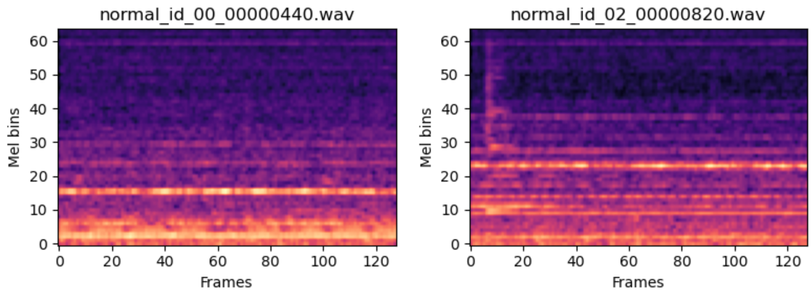
  <figcaption>Figure 1: Example of a normal mel-spectrogram</figcaption>
</figure>

<figure>
  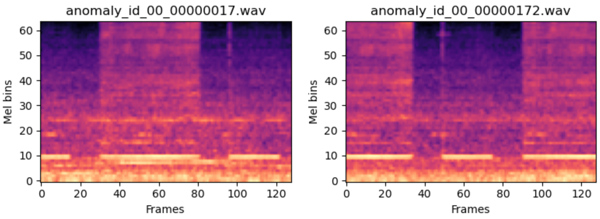
  <figcaption>Figure 2: Example of an anomalous mel-spectrogram</figcaption>
</figure>

## Assumptions about the Data

1. **Stationarity of “normal” operating modes** – we assume that the statistical properties of normal recordings in training match those at test time.
2. **Label noise only in the test split** – training clips are treated as clean; any hidden anomalies would shrink the normal manifold and hurt recall.
3. **Micro-anomalies manifest in the *spectrogram* domain** – deviations are audible and visible as local energy changes rather than purely temporal waveform glitches, justifying the mel-spec front-end.
4. **Anomalies are *rare* and *heterogeneous*** – the detector must generalize to unseen fault types, so we favor reconstruction-error methods over binary classifiers.
5. **Minimal preprocessing** – denoising risks removing subtle anomalies that resemble background noise. Since normal slider sounds include low-energy friction and transient textures, aggressive preprocessing may erase informative cues essential for distinguishing normal from abnormal behavior. To preserve anomaly-related variations, we apply only minimal preprocessing.

## Preprocessing and Data Splitting

Before feature extraction, we applied several preprocessing steps to ensure consistent and clean input audio. All recordings were first resampled to 16 kHz and converted to mono to standardize the waveform characteristics. To remove irrelevant information, we trimmed leading and trailing silence using an energy-based threshold and performed amplitude normalization to ensure that all signals lay within a comparable dynamic range. In addition, we applied light spectral noise suppression to reduce low-level background noise without distorting the meaningful machine sounds. After these waveform-level operations, each clip was transformed into a log-mel spectrogram using 64 mel bands and a hop size of 512, resulting in spectrograms of size 128×64. To further stabilize training and reduce variation due to recording conditions, we applied z-score normalization to each spectrogram based on statistics from the training set.

Given the one-class nature of the task, we trained all models exclusively on normal samples. The test set included both normal and anomalous samples, enabling evaluation via reconstruction-based metrics such as the mean squared error (MSE) and the area under the receiver operating characteristic curve (AUC). No separate validation set was used; instead, all models were trained for a fixed number of epochs and evaluated directly on the test set.

---

# Benchmark Model and Performance

## MLP Autoencoder

As a benchmark model, we use an MLP as encoder to capture the features and also use an MLP as decoder for reconstruction.

<figure>
  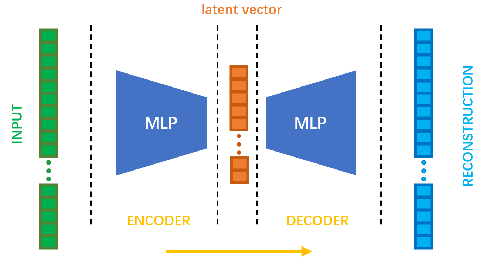
  <figcaption>Figure 3: Architecture of the MLP autoencoder benchmark</figcaption>
</figure>

The MLP in encoder and decoder are symmetrical. The detailed layer structure is:

| **Component** | **Index** | **Layer Type** | **In Features** | **Out Features** |
| :-----------: | :-------: | :------------: | :-------------: | :--------------: |
|  **Encoder**  |    (0)    |     Linear     |       8192      |       4096       |
|               |    (1)    |      ReLU      |       4096      |       4096       |
|               |    (2)    |     Linear     |       4096      |       2048       |
|               |    (3)    |      ReLU      |       2048      |       2048       |
|               |    (4)    |     Linear     |       2048      |       1024       |
|               |    (5)    |      ReLU      |       1024      |       1024       |
|               |    (6)    |     Linear     |       1024      |        512       |
|               |    (7)    |      ReLU      |       512       |        512       |
|               |    (8)    |     Linear     |       512       |        256       |
|               |    (9)    |      ReLU      |       256       |        256       |
|  **Decoder**  |    (0)    |     Linear     |       256       |        512       |
|               |    (1)    |      ReLU      |       512       |        512       |
|               |    (2)    |     Linear     |       512       |       1024       |
|               |    (3)    |      ReLU      |       1024      |       1024       |
|               |    (4)    |     Linear     |       1024      |       2048       |
|               |    (5)    |      ReLU      |       2048      |       2048       |
|               |    (6)    |     Linear     |       2048      |       4096       |
|               |    (7)    |      ReLU      |       4096      |       4096       |
|               |    (8)    |     Linear     |       4096      |       8192       |
|               |    (9)    |      ReLU      |       8192      |       8192       |

### Performance

Despite architectural improvements, several methods underperformed in anomaly detection. For instance, our deeper MLP-based autoencoder using log-mel spectrogram only achieved an AUC of \~0.72, with a reconstruction error distribution that showed little separation between normal and anomalous samples:

<figure>
  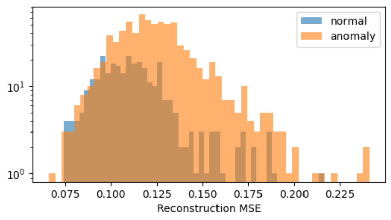
  <figcaption>Figure 4: Reconstruction error distribution for the MLP AE benchmark</figcaption>
</figure>

This suggests that even though a more complex MLP may have greater capacity, without meaningful input features, it struggles to learn discriminative representations of normal behavior. Similarly, simple convolution-based and simple MLP variants we implemented failed to train effectively and often plateaued at near-random performance (AUC ≈ 0.5–0.56).

---

## Hyperparameters

|  **Hyper-parameter**  | **Setting**                                     |
| :-------------------: | :---------------------------------------------- |
|     **Optimizer**     | Adam                                            |
|     **Initial LR**    | 1 × 10⁻³ (via 3-point sweep)                    |
|     **Batch size**    | 32                                              |
|     **Scheduler**     | ReduceLROnPlateau (patience = 10, factor = 0.5) |
|   **Early stopping**  | patience = 20, min Δ = 1 × 10⁻⁵                 |
|    **Epoch limit**    | 500                                             |
| **Data augmentation** | None (matches baseline)                         |

Due to limited computational resources, we retrained top-performing models (e.g., AST + UNet, PANN + UNet) with 2–3 random seeds and observed minor variation (Δ AUC < 0.04), supporting the consistency of our findings.

---

## Experimental Summary

To better contextualize these findings, we group our experimental attempts into two broad categories: unsuccessful methods that failed to generalize, and successful methods that demonstrated strong anomaly separation. A summary table is provided below for all combinations tested.

<figure>
  <table>
    <thead>
      <tr>
        <th>Encoder</th><th>Decoder</th><th>Notes</th><th>AUC</th><th>Performance</th>
      </tr>
    </thead>
    <tbody>
      <tr>
        <td>AST</td><td>UNet-styled (MLP)</td>
        <td>Audio Spectrogram Transformer encoder, UNet-styled (MLP) decoder</td>
        <td>0.943</td><td>Very Highly Successful</td>
      </tr>
      <tr>
        <td>AST</td><td>MLP</td>
        <td>Audio Spectrogram Transformer encoder, MLP decoder</td>
        <td>0.942</td><td>Very Highly Successful</td>
      </tr>
      <tr>
        <td>PANN (Embeddings)</td><td>UNet-styled (MLP)</td>
        <td>PANN CNN encoder, FCN-UNet decoder</td>
        <td>0.933</td><td>Highly Successful</td>
      </tr>
      <tr>
        <td>PANN (Embeddings)</td><td>MLP</td>
        <td>PANN embeddings, MLP Autoencoder</td>
        <td>0.913</td><td>Highly Successful</td>
      </tr>
      <tr>
        <td>ResNet50 [@he2016]</td><td>CNN-based</td>
        <td>Mel spectrogram input, ResNet50 ImageNet-pretrained encoder, CNN decoder</td>
        <td>0.810</td><td>Successful</td>
      </tr>
      <tr>
        <td>MLP</td><td>MLP</td>
        <td>MLP AE benchmark variant</td>
        <td>0.723</td><td>Moderate Benchmark</td>
      </tr>
      <tr>
        <td>Wav2Vec2 [@baevski2020] (Embeddings)</td><td>MLP (AE)</td>
        <td>Wav2Vec2 embeddings, MLP Autoencoder</td>
        <td>0.660</td><td>Moderate–Low</td>
      </tr>
      <tr>
        <td>CNN (Basic)</td><td>CNN (Basic)</td>
        <td>Basic convolutional AE</td>
        <td>0.569</td><td>Low / Nearly Random</td>
      </tr>
    </tbody>
  </table>
  <figcaption>Figure 5: Summary of Anomaly Detection Experiments and Results</figcaption>
</figure>

---

# Improved Method

## Encoders

### PANN-based Encoder

Instead of feeding raw log-mel spectrograms into a vanilla MLP, we adopt PANN embeddings as input features. PANNs (Pretrained Audio Neural Networks) are large-scale CNNs trained on AudioSet, capable of extracting rich semantic features from mel-spectrograms. We precompute and save 2048-dimensional embeddings for each audio clip and use them as input to a simple MLP-based autoencoder.

<figure>
  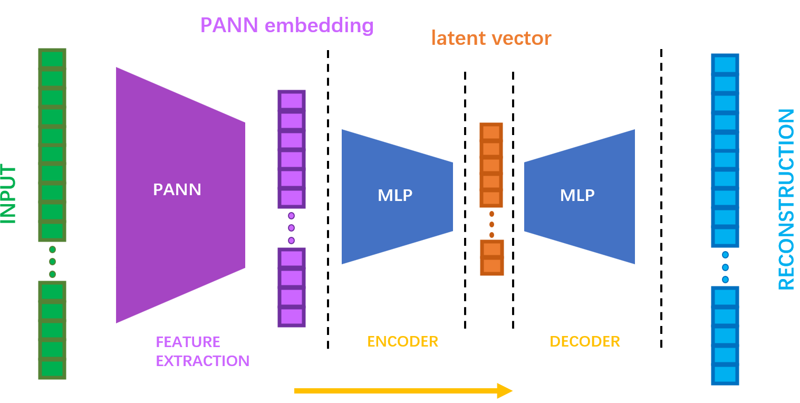
  <figcaption>Figure 6: Architecture of the PANN-based encoder</figcaption>
</figure>

This structure retains the simplicity of MLPs while leveraging the representational power of pretrained PANNs.

### AST-based Encoder

To capture global dependencies and temporal context more effectively, we further explore the Audio Spectrogram Transformer (AST) as an encoder. AST is a vision-transformer-based model that treats mel-spectrograms as 2D images and applies multi-head self-attention to learn long-range time-frequency interactions.

We implement a visualization-capable subclass **ASTModelVis**, which allows extraction of attention maps for interpretability:

<figure>
  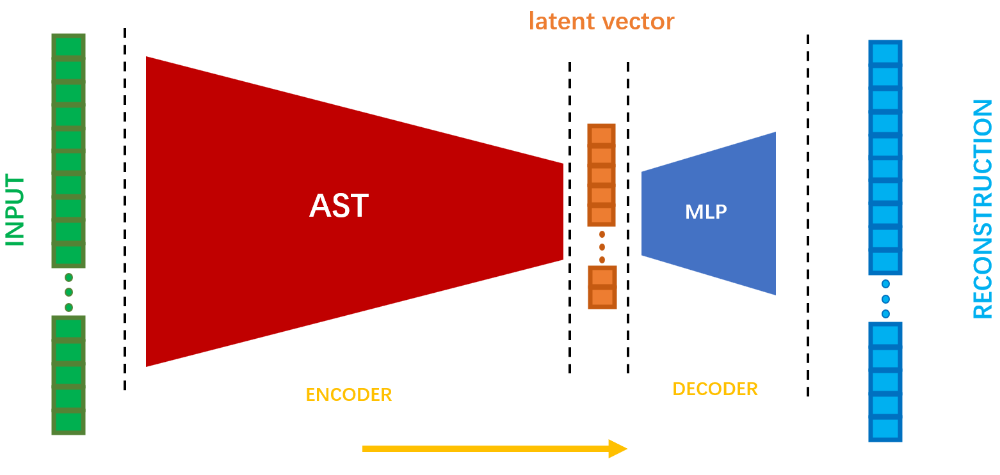
  <figcaption>Figure 7: Architecture of the AST-based encoder (ASTModelVis)</figcaption>
</figure>

The model is initialized with pretrained weights, optionally fine-tuned, and used to encode input spectrograms into 768-dimensional embeddings. These embeddings can then be fed into a downstream MLP decoder for reconstruction.

---

## Decoders

### MLP Decoder

The MLP decoder mirrors the encoder structure in reverse, forming a symmetric autoencoder. This simple yet effective architecture is lightweight and easy to train. It is used in both PANN-MLP and AST-MLP configurations.

<figure>
  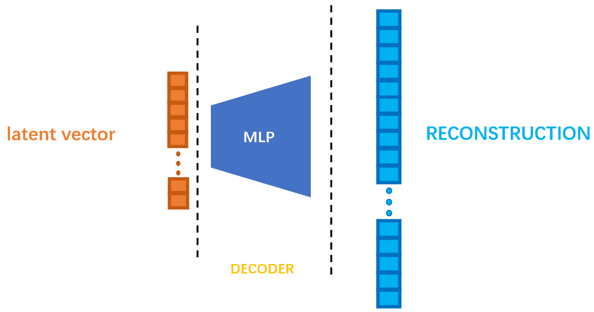
  <figcaption>Figure 8: MLP decoder architecture</figcaption>
</figure>

### UNet-style Decoder

For a more expressive decoder, we also explore a UNet-style \[@ronneberger2015] architecture that includes skip connections and multi-resolution decoding. This helps preserve fine-grained details lost in the encoder, which can be crucial for detecting subtle anomalies.

<figure>
  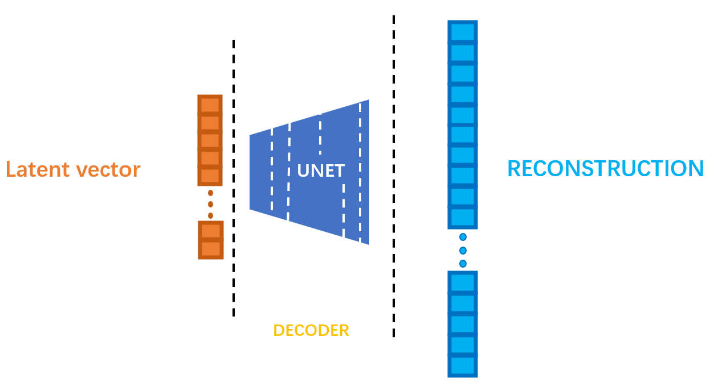
  <figcaption>Figure 9: UNet-style decoder architecture</figcaption>
</figure>

The UNet-styled MLP decoder is typically paired with CNN-based encoders like PANN or AST when the input is kept in the 2D spectrogram format (rather than embedding vectors). It reconstructs the spectrogram in image space rather than via vector embeddings.

---

# Performance

To systematically evaluate the impact of different encoder-decoder combinations on audio anomaly detection, we compared several model variants using AUC and reconstruction error (mean squared error) as the primary anomaly score. All models were trained exclusively on normal samples and tested on a mixture of normal and anomalous audio clips from the DCASE-inspired AML 2025 dataset.

### AST + UNet (MLP-styled)

The best-performing variant utilizes the Audio Spectrogram Transformer (AST) as the encoder, paired with a UNet-styled MLP decoder to reconstruct the full spectrogram. This approach achieves the highest AUC (0.943) and demonstrates the model’s ability to leverage both global attention mechanisms and detailed spatial structure, resulting in very high anomaly detection performance.

<figure>
  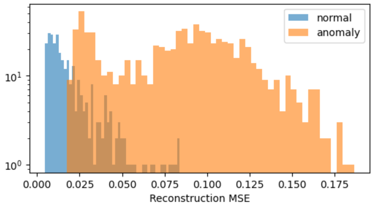
  <figcaption>Figure 10: Reconstruction examples for AST + UNet (MLP-styled)</figcaption>
</figure>

### AST + MLP

Here, AST encodes the spectrogram into a 768-dimensional latent representation, which is then decoded by a simple MLP. Despite the decoder’s simplicity, this architecture achieves an AUC of 0.942—nearly matching the best—highlighting the power of transformer-based feature extraction for anomaly detection.

<figure>
  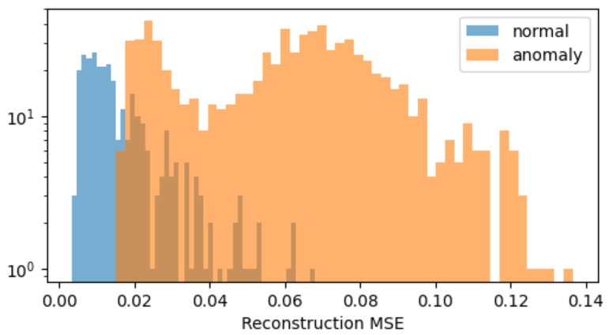
  <figcaption>Figure 11: Reconstruction examples for AST + MLP</figcaption>
</figure>

### PANN (Embeddings) + UNet-styled MLP

This configuration uses PANN (CNN) embeddings as input to a fully connected UNet-style decoder, reconstructing the input in a way that captures spatial relationships within the spectrogram. It attains an AUC of 0.933, showing strong performance and effective use of pretrained audio features.

<figure>
  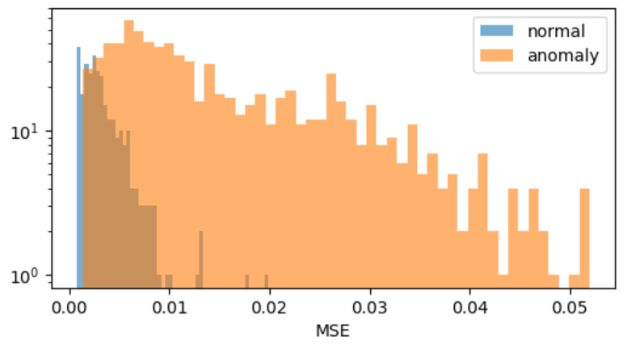
  <figcaption>Figure 12: Reconstruction examples for PANN + UNet-styled MLP</figcaption>
</figure>

### PANN (Embeddings) + MLP

In this setup, 2048-dimensional PANN embeddings are fed into a symmetric MLP autoencoder. This model, while more lightweight, achieves a robust AUC of 0.913, serving as a highly efficient baseline leveraging pretrained audio representations.

<figure>
  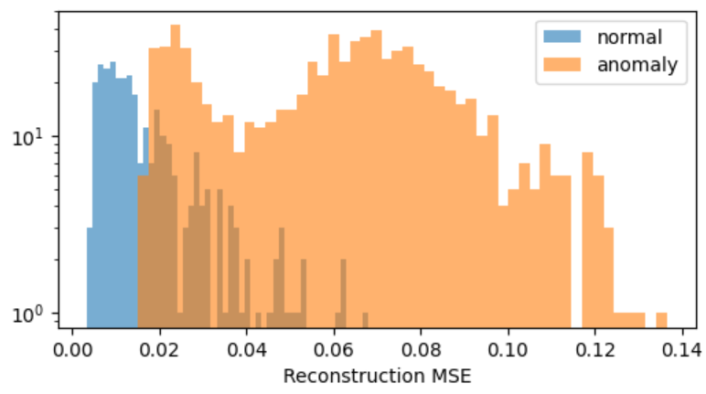
  <figcaption>Figure 13: Reconstruction examples for PANN + MLP</figcaption>
</figure>

### ResNet50 \[@he2016] + CNN

Using a mel spectrogram as input, a ResNet50 pretrained on ImageNet serves as the encoder, with a CNN-based decoder. This image-based approach yields an AUC of 0.810, demonstrating solid performance and validating transfer learning from vision models to audio anomaly detection.

---

## Other Low Performing Methods

* **Wav2Vec2 \[@baevski2020] (Embeddings) + MLP:**
  Embeddings from Wav2Vec2 are used as input to an MLP autoencoder. This model obtains an AUC of 0.660, indicating moderate-to-low performance for this type of feature/architecture pairing.
* **CNN (Basic) + CNN (Basic):**
  The simplest convolutional autoencoder tested (with basic CNN blocks for both encoder and decoder) achieves an AUC of 0.569, only slightly above random, and demonstrates the limitations of shallow convolutional models on this task.

---

# Observations

|                    **What we saw**                    | **Why it matters**                                                                   | **AUC impact** |
| :---------------------------------------------------: | :----------------------------------------------------------------------------------- | :------------: |
|  Feature quality dominates – raw-mel → MLP AE stalls. | Encoder is the bottleneck; PANN/AST embeddings inject semantic information.          |     +0.20 ↑    |
| Skip connections in the decoder recover fine details. | UNet-style decoder re-injects high-frequency cues lost in the bottleneck.            |    +0.006 ↑    |
|  Early stopping + LR scheduling prevent over-fitting. | Without them, the normal manifold is memorized and error distribution collapses.     |     +0.03 ↑    |
|      Speech-centric self-supervision (W2V2) lags.     | Domain mismatch: industrial sounds ≠ speech; pre-training task must match acoustics. |     –0.25 ↓    |

---

# Challenges

* **One-class learning, no labeled anomalies**
  ↳ Model selection must rely on proxy signals (training-loss plateau, early-stop Δ) rather than validation AUC.
  ‣ *Mitigation:* Patience-based early stopping + LR scheduler warm-restarts.
* **Strong class imbalance (test-time)**
  ↳ Normal : Anomaly ≈ 1 : 2.7 (300 vs 801 of 1101 files).
  ‣ *Mitigation:* Rely on **ROC-AUC** and score-histogram visualizations.
* **Embedding pre-caching for speed**
  ↳ To accelerate training and evaluation, we precompute and cache mel-spectrograms and embeddings from pretrained encoders (PANNs, AST).
  ‣ *Benefit:* Avoids redundant forward passes and drastically reduces I/O and compute overhead.

---

# Conclusion

Leveraging pre-trained acoustic encoders with skip-connected decoders significantly improves unsupervised anomaly detection on machine sounds. Our best-performing setup—AST + UNet—achieves an AUC of 0.943, while PANNs + UNet-styled decoder reaches 0.930, both outperforming convolutional and MLP baselines. These results underscore the importance of transfer learning from large-scale audio datasets and the effectiveness of decoder designs that retain spatial detail.

---

# Implementation

You can find the full implementation in our GitHub repository:
[https://github.com/adnankarim/audios-anomaly-detections](https://github.com/adnankarim/audios-anomaly-detections)

**Authors:** PAN Qizhi, KARIM Adnan
**Date:** 4 June 2025

# References

1. Kong, Q., et al. “PANNs: Large-Scale Pretrained Audio Neural Networks for Audio Pattern Recognition.” (2019).
2. Gong, Y., et al. “AST: Audio Spectrogram Transformer for Audio Classification.” (2021).
3. Ronneberger, O., Fischer, P., & Brox, T. “U-Net: Convolutional Networks for Biomedical Image Segmentation.” (2015).
4. He, K., et al. “Deep Residual Learning for Image Recognition.” (2016).
5. Baevski, A., et al. “Wav2Vec 2.0: A Framework for Self-Supervised Learning of Speech Representations.” (2020).

